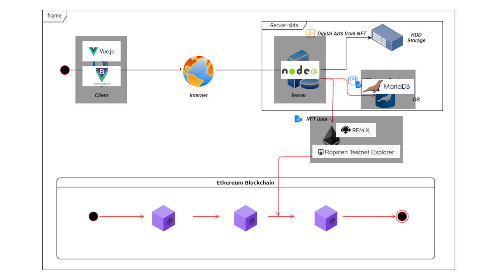

## 🔗 2021 Hdac Technology Competition - NFT를 활용한 서비스 모델 개발

### 프로젝트 개요

-   프로젝트 과정 : 2021 혁신성장 청년인재 양성사업, 블록체인을 활용한 비즈니스 모델 개발
-   프로젝트 명 : NFT 기반 아마추어 아티스트 후원 플랫폼, 아마도(AMADO)
-   프로젝트 기간 : 21.08.25 ~ 21.09.27
-   구현 목표 :
    1. 아마추어 아티스트들의 작품 및 데이터 앱 내 진열 후 특정 기부자가 아티스아마추어 아티스트들의 작품을 구매하여 NFT로 민팅
    2. 아마추어 아티스들의 작품을 웹 상에서 전시할 수 있는 갤러리 공간 제작

### 프로젝트 설명

**1. 서비스 설명**  
디지털 인증서라 불리는 'NFT'라는 블록체인 기술을 활용하여 경제적인 어려움을 겪는 아마추어 예술가들의 작품활동을 지지하는 기부 플랫폼입니다. 저희 플랫폼을 통해 아마추어 예술가들의 작품을 NFT로 발행하고, 플랫폼 상의 후원자들을 모집해 발행된 NFT를 후원하도록 하거나 플랫폼 상에 후원된 금액을 플랫폼 내 아티스트들에게 적절히 분배하여 후원합니다.

**2. 현황(문제점)**  
우리나라 미술분야에서는 실제 작가로서의 위상을 지닌 경우가 30%에 불과합니다. 이는 개인 전시를 통해, 작가로서의 위상을 쌓기에는 전시 자체에 대한 비용 및 진입의 문턱이 높은 현실(작품 활동 비용 및 대관 비용 문제) 때문입니다. 따라서, 현재 아마추어 아티스트들은 경제적 문제로 지원을 받아야만 개인 전시자체를 할 수 있지만, 그 지원 규모가 작아 시도조차 못하는 것을 개선하고자 했습니다.

**3. 블록체인 기술을 통해 해결하고자 하는 과제**  
현재의 우리나라 아마추어 예술가들이 가장 큰 문제점은 너무 작은 시장규모에 국한되어있다는 점입니다. 블록체인 서비스는 기본적으로 글로벌하게 이뤄지므로 우리나라 아마추어 예술가들의 후원 및 수익 시장을 보다 넓히는 데 가장 효과적인 분야라 생각했습니다. 또한, 블록체인 기술을 통해 후원자들은 투명성있는 후원을 할 수 있으며 NFT를 통해 특정 예술가에게 바로 후원할 수도 있습니다. 저희 팀은 이런 생태계를 유지하여 앞으로 펼쳐질 다양한 디지털 세상에 필요한 크리에이티브한 콘텐츠를 창출하는 아마추어 아티스트들의 육성에 기여하는 플랫폼이 되고자 합니다.

### 팀원 소개

-   **팀명 : NFTeam(Non Fungible Team)**

    1. [팀장/Jeongseup, Son](https://github.com/Jeongseup)

    -   담당역할 : 기획 총괄 및 스마트 컨트랙트 개발
    -   업무내용 : 팀원들이 개발한 내용이 잘 맞춰질 수 있도록 개발 방향성을 이끌어감
    -   사용툴 : VScode, AWS RDS, Remix IDE, Pinata IPFS provider
    -

    2. [팀원/도희경](https://github.com/heekyungdo)

    -   담당역할 : 서비스 디자인 총괄
    -   업무내용 : 웹 서비스 전반적인 디자인 템플릿을 제작하고, 웹 사이트 프레임 설계
    -   사용툴 : VScode, CSS, Bootstrap
    -

    3. [팀원/정은경](https://github.com/luckyjek)

    -   담당역할 : 인터랙티브 디자인
    -   업무내용 : 팀원들이 개발한 내용이 잘 맞춰질 수 있도록 개발 방향성을 이끌어감
    -   사용툴 : VScode, filepond lib, Bootstrap, Interactive web libs
    -

    4. [팀원/서장연](https://github.com/Shumay14)

    -   담당역할 : 서버 및 DB 백엔드 담당
    -   업무내용 : 서버사이드 MVC 설계 및 DB 아키텍쳐 설계
    -   사용툴 : VScode / Node.js(express) / MariaDB / ejs template engine

---

### 프로젝트 세부 수행과정

#### 프로젝트 기획(21.08.25 ~ 21.09.08)

<a href ='./presentation/아트아카데미-기획서.pdf'  target="_blank">1. AMADO 프로젝트 기획</a> 
<a href ='./presentation/아트아카데미-아키텍쳐설계.pdf'  target="_blank">2. AMADO 프로젝트 아키텍쳐 설계</a> 
<a href ='./presentation/아트아카데미-발표자료.pdf'  target="_blank">3. AMADO 프로젝트 발표자료 준비(21.09.26)</a> 

#### 기술스택 정의서

</img>

#### 어플리케이션 실행 환경

-   프론트엔드 : HTML5 + CSS
-   백엔드 : express framework + MVC 구조
-   서버 템플릿 : EJS
-   DB - AWS RDS 프리티어(MariaDB-10.4.13 / 파라미터 세팅 : utf8 & utf_genernal_ci)
-   blockchain protocol : Ethereum Ropsten Testnet
-   blockchain provider : Metamask / PINATA IPFS

#### 어플리케이션 실행 메뉴얼

> 1. git clone이후, VScode에서 프로젝트 폴더 내 app 폴더로 열어줍니다.
> 2. terminal에 npm install 로 필요한 js library를 설치합니다.
> 3. app 폴더 내에 .env 파일을 생성하고, 연결할 DB 정보를 입력합니다.(ex: DATABASE_HOST = "test...")
> 4. 설치 이후, terminal 창에서 npm start를 입력하여 실행합니다.

#### 팀원별 개발 디자인 소개

-   기획 및 컨트랙트 개발 / Jeonsgseup, Son

본 기획은 이전 개인 Art Acamedy 라는 프로젝트를 발전시킨 프로젝트입니다. 본 기획의 목표는 상기 표기되어 있듯이, 작은 시장규모로 인해 잠재력있는 young & fresh한 우리나라 아티스트들에게 경제적인 지원 및 시장을 확장하고자 본 프로젝트를 기획하였습니다. 또한, 초기 경제성이 부족한 상황을 인지하고 NFT 마켓플레이스보다는 후원플랫폼을 기준으로 프로젝트를 디자인했으며, 기존 Giveth라는 후원 플랫폼의 UX 프로세스를 바탕으로 전체적인 프로세스를 디자인을 하였습니다.

본 어플리케이션 내에 스마트 컨트랙트는 이더리움 테스트넷 상에서 이뤄지며, 우선 규모있는 시장성에서 많은 경제적인 기회를 포착하기 가장 용이하다라고 생각했기 때문에 이더리움 테스트넷에서 개발을 진행하였습니다. 프로젝트 내 이더리움 토큰은 ERC-721를 기준으로 개발하였으며, 컨트랙트 오딧사인 openzeppelin의 IERC를 기준으로 개발하였습니다.

-   웹 UI/UX 디자인 총괄 / 도희경

UI – 기부 플랫폼에 맞춰 전체적인 색상을 노란색으로 선택했습니다. 노란색은 따뜻하고, 명랑하고 밝은 느낌이 있습니다. 기부라는 행위의 따뜻함과, 기부받은 아티스트의 미래는 명랑하고 밝을 것이기에 이 두가지 측면을 고려하여 노란색을 택하였습니다.

UX – 기부자와 아티스트가 서비스를 사용하는데, 어려움이 없도록 각 사용자에 맞춰 디자인했습니다. 기부자 측면에서 다양한 NFT와 그 NFT를 발행한 아티스트의 정보를 함께 제공받을 수 있도록 하였습니다. 우리 서비스에서 발행된 모든 NFT를 볼 수 있는 페이지와 기부자가 클릭한 하나의 NFT와 해당 NFT를 발행한 아티스트 정보를 한 눈에 볼 수 있는 페이지를 구성하였습니다.

아티스트 측면에서는 NFT라는 어렵고 낯선 것을 쉽게 발행할 수 있도록 하였습니다. 구매자가 미술작품을 구매할 때 아티스트의 이력을 보는 것 같이, 아티스트의 정보를 볼 수 있는 페이지에서는 아티스트의 NFT 뿐 아니라 자신만의 좌우명 또는 슬로건을 보여줄 수 있도록 하였습니다. 세부 디자인은 기부 문화와 아티스트들의 밝은 미래를 강조하기 위해 귀엽고, 발랄한 느낌이 나도록 동적이고, 귀엽게 구성하였습니다.

#### 프로젝트 개발시연 영상

https://www.youtube.com/watch?v=XvaYc2APpUk

### 참고자료

-   ERC-721 - 스마트 컨트랙트 인터페이스
    (https://docs.openzeppelin.com/contracts/4.x/erc721)

-   PINATA IPFS : How to pin to IPFS effortlessly
    (https://medium.com/pinata/how-to-pin-to-ipfs-effortlessly-ba3437b33885)

-   DAPP tutorial : 리액트로 구현하는 블록체인 이더리움 ERC721(NFT)
    (https://www.inflearn.com/course/erc-721/dashboard)
